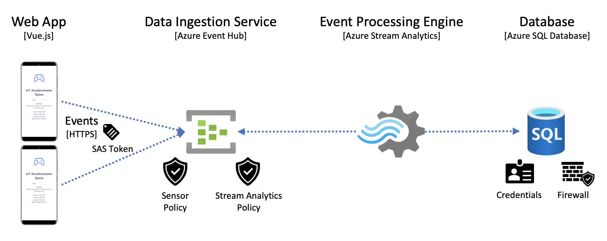

# Introduction

* Frontend Service
  * Web App (`Vue.js`): Collect and push accelerometer events
* Backend Services
  * Data Ingestion Service (`Azure Event Hub`): Receive events
  * Event Processing Engine (`Azure Stream Analytics`): Ingests data from Event Hub, transform and send data to a database
  * Database (`Azure SQL Database`): Store data
