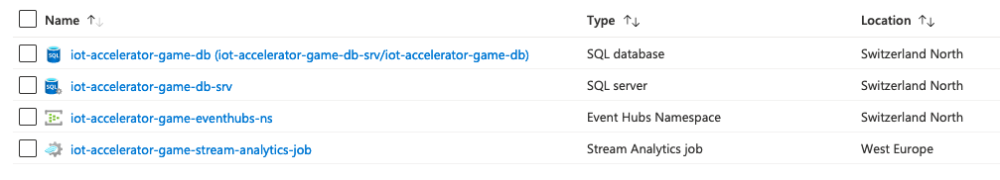
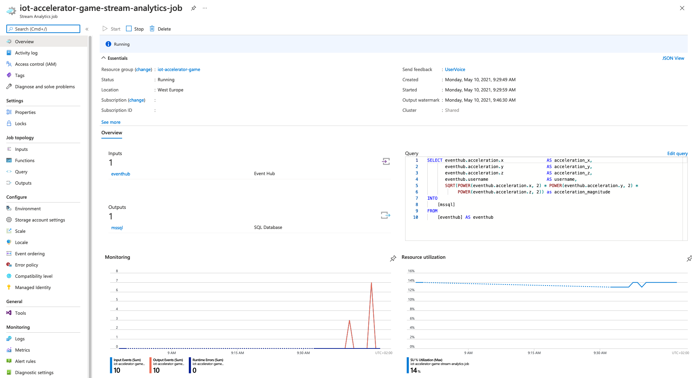
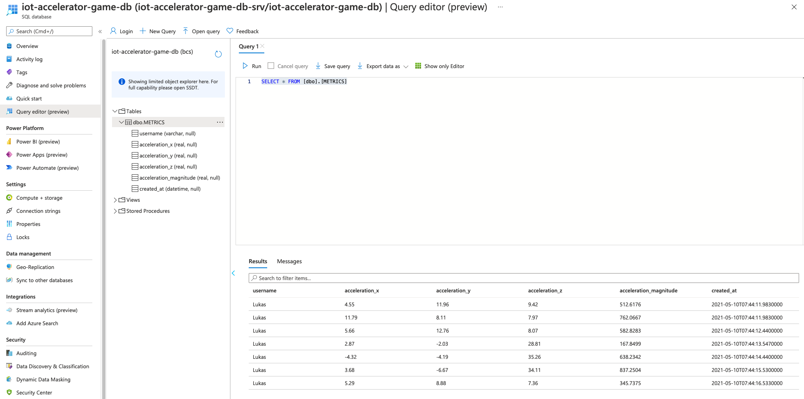

# Exercises

::: tip Basic Exercises

* Create new `Stream Analytics Jobs`
* Add `Event Hub` as Input to `Stream Analytics Job`
* Add custom Query to `Stream Analytics Job` [^1]
* Add new table to `SQL Database`
* Add table as Output to `Stream Analytics Job`

:::

::: tip Advanced Exercises

* Integrate additional sensor using `Sensor Web APIs` [^2]
* Create `Apache JMeter` test for data ingestion [^3]

:::

## Resources

## Stream Analytics Job

## Database

[^1]: <https://docs.microsoft.com/en-us/stream-analytics-query/stream-analytics-query-language-reference>
[^2]: <https://developer.mozilla.org/en-US/docs/Web/API/Sensor_APIs>
[^3]: <https://jmeter.apache.org/>
